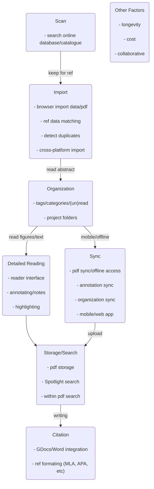

### My ideal workflow
I hate reading papers on my laptop, and I'm too self-conscious and/or disorganized to print papers, especially if I'm planning for a long reading session, e.g., literature review. I don't do lit reviews for new projects all that often, but the random new papers here and there, plus my Google Scholars & biorxiv feed, accumulate over weeks to months of neglect, that they effectively become a lit review when I get around to reading them. Y'all know what I'm talking about: every 3 months I would have a new folder on the desktop named "to_read_papers". 4 years into my PhD and I still haven't figured out whether I'm doing this paper-reading thing right, but I've been managing with Papers 3 in the last few years, and have gotten comfortable/practiced with using its array of features.

Still, reading a vertically organized pdf on a horizontal laptop screen is just plain wrong, so much so that I used to flip my external monitor just so that it mimics a vertical reading experience. Plus, I like to be in all sorts of physical positions when I read, like sitting on the bus without a supporting surface, or with my head hanging off my bed. First world problem, I know. So I finally decided to get an uncomfortably large 12.9-inch iPad Pro. My backpack was unhappy but my eyes were crying tears of joy, because my god, the reading experience is amazing, plus I can do it pretty much anywhere, anytime. However, with the introduction of yet another piece of technology into my life, I had to modify my workflow, the central component of which was the reference management software. Fortunately, Papers had an iOS app that did everything the Mac app did, plus it offered automatic syncing on the same Wifi network or through Dropbox. Unfortunately, it did not run very smoothly (more details below). So naturally, I decided I should bite the bullet and try ALL the (major) reference management softwares: Papers 3, Zotero, F1000Workspace, and Paperpile. Mendeley is missing but I will briefly talk about why it was excluded, and I did not consider RefWorks or EndNote at all, because $$$.

Below are my reviews for each app, but before we get to that, a disclaimer: my preferences are specific to my ideal workflow, which I have re-designed to include the iPad. Check out the cool flowchart I drew, in Markdown (with mermaid)! Briefly, the steps are: get paper (Scan/Import), file paper (Organization), read paper (Reading/Note-taking), and later, find paper (Storage/Search and Citing), with the additional requirement of syncing between my two devices - I do all my writing on my laptop, and ideally, I will be doing all my reading and organization on the iPad, so it's important that they are reliably and easily synchronized. In other words, I want to download some papers (pdfs) onto my laptop, sync them to my iPad, read, annotate, tag them accordingly, have the app sync those changes in the background to the cloud (or directly to my laptop), and have access to those notes when I write my papers, with the proper citation-formatting capabilities, of course. Your workflow may be very different, and you might not mind reading a vertical document horizontally so much. With that in mind, the other sections for each app are hopefully still useful. But if you're so hardcore that you only read in physical paper form, or if you for some reason like reading in the html format, then I can't really help you, though you might consider adopting a different workflow to save some trees (or be less weird). Also, if you're just starting your research career, grad or undergrad, hopefully this guide will be informative on which app you want to use for the next few years.

### Papers 3 (ReadCube)
**Price**: \$50 one time, soon to be \$36/year subscription.

I've been using Papers 3 for the last 2.5 years, and I really liked it. I paid \$50 for it, so you bet I'm gonna like it. Overall, the desktop (Mac) and iOS apps were great - rich features, automatic syncing over Wifi and Dropbox, and serviceable customer support. But the entire reason for this deep dive on reference management software is that I wanted to switch from Papers, and it's for two reasons: first, various aspects of the app are getting buggy, ranging from general slowness of the desktop app during searching/accessing pdfs, consistent crashing of the Citation plug-in, and weird sync issues with the iOS app; second, Papers is now merged with ReadCube (the reader interface Nature family journals try to make you use when you read articles online - why???), and they will soon rollout a new ReadCube app under a monthly subscription model. Papers 3 users can upgrade at a discount, and the old app will (so they say) be supported indefinitely, but let's be real here: it's getting killed. No matter, here's the deep dive in case you're considering Papers or the new app, they'll probably be pretty similar.

**Scan/Importing:** Searching for articles in the Mac app itself is easy, and I've actually used it a bunch for doing lit searches prior to starting a project. "Importing" a references from the search interface is just one button click, but getting the pdf itself can be a pain with paywall journals, as you have to click through multiple pages in this clunky web browser thing inside the app. You can also just drag and drop pdfs, and reference matching for published articles, for the most part, is very accurate. It's a different story for preprints, but that's mostly because the information isn't there.  Duplicate reference detection is automatic, and clearly displayed as a column, so that's a plus. Overall, great functionality here.

Here's something that really annoyed me, though: there was no easy way to import, tag, and categorize papers simultaneously as I first come across it. For example, 50% or more of the time, I would read a paper's abstract when someone sends it to me, scan the figures for anything unexpected, and decide that it could be a useful reference for the future, but not really needing to think about it again until citation time. From that point on, with Papers 3, I would have to download the pdf into the designated watch folder, and open the app to tag or write down my immediate thoughts. Since the app is so bulky, I usually just save that step for later (read: never), except this introduces crazy unnecessary cognitive load, because I already know how I want to file this paper at this moment, but I will have to retrieve it from my memory weeks or months later, when I get around to actually tagging it. I hated this so much that I started to append what I would have tagged them as to the pdf file names when I save them. I thought this problem was unavoidable, until I tried the other 3 apps on this list, which all have Chrome extensions for direct import into library and easy tagging, and holy shit bro this was life changing. Having a sensible organizational system is great, but its usefulness is directly tied to how easy it is to actually use it. 3/5

**Organization:** Papers offer a large set of organizational tools, including keyword tags, collections (folders), color tags, flag (for importance), and read/unread marker. I used tags to tag permanent properties, like the method used in the paper, or the model organism, folders for each of my ongoing projects, colors for denoting the level of detail to which I read the paper (green for abstract, red for full text, etc), and flag for marking really relevant papers that I will probably revisit. I've gotten used to these different markers, so it feels natural, though my biggest complaint is probably that there doesn't seem to be a way to hierarchically organize tags, and finding articles under multiple tags is needlessly difficult (compare to Zotero). 4/5

**Reading/Note-taking:** Papers offer its own reader, which opens the pdf inside the app. Highlighting and text-box comments are easy to make, and these annotations show up on the righthand side toolbar during reading (reader-view) and preview (library-view). You can also write plaintext notes within the toolbar. It looks like highlights made in Preview are visible in the Papers reader, but the other way around doesn't always work until the library (and pdfs) are formally exported out of Papers, which show up as external notes in all the other reference management programs. Minor inconvenience. 4.5/5

**Mobile/Offline Syncing:** Because the Mac app runs on the machine itself, and all pdfs are stored locally, reading offline on the computer is not an issue at all. In contrast, while the iOS app attempts to mirror the same kind of functionalities on the iPad, it falls way short. For one, pdfs cannot be accessed offline on the iPad until they're manually downloaded, within the app. That's easy enough to do, it's just a few button clicks, but that just means you'll have a big batch download at some point, though I suppose there's no other way to do it, other than perhaps a "Download all upon sync" button for a one-time local storage. You could also only download ahead of time the papers you will be reading during your next commute, so that's actually a plus for space-saving. The same tagging / organizational tools exist on the iPad, and the interface itself is quite similar, which is really nice.

Theoretically, this is the perfect iPad companion app. Practically, it's unreasonably buggy and slow, so much so that I actively don't want to use it. Again, the tool is as great as how often you actually use it. For some reason, syncing changes to <10 pdfs take multiple minutes, especially annotations and tags. I don't know if it's because I'm doing it over Wifi, as opposed to Dropbox, but I suspect it's because of the virtual disk system Papers sets up to manage and store the pdfs (don't care enough to dive into, and I don't quite understand why it needs to be that complicated). To be honest, if there was any prospect of this thing getting better through updates, I would probably happily suffer for a few more months. But as it stands, unlikely. 2/5

**Storage/Search:** Papers used to have **really** great Spotlight integration, such that both titles and text within the pdf can be searched. For some reason, that functionality is not there anymore. No matter, Papers comes with a tool called Citations, which serves as the Word integration tool, but also is like its own private Spotlight, and it works really well, I almost always find the paper I'm looking for within a few words. Huge caveat here, though: from around 6 months ago, Citation has been crashing 75% of the time when called up via hotkey. I've emailed support and they say other customers have been experiencing similar issues, and basically told me to reinstall as a solution. Well, I tried, and it didn't work, which makes me more skeptical of continued support (though the support staff I interacted with were all very pleasant and tried to be helpful.)

Searching within the Papers app, though, gives you the joyful experience of traveling back in time, like if you were using a Win95 PC, especially when searching by author. For some reason, this takes literally forever (I have about 1200 pdfs), to the point that it lags my computer as I type in the author's name in the search bar. Again, not exactly sure why, but I think it relates to the way Papers implements its file storage architecture. To expand a bit more on that, when references/pdfs are imported into Papers, it deletes the original copies and "hides" them in an internal file structure that is accessible through the app. To access those pdfs in Finder again, Papers sets up a virtual disk using this program called FUSE, and
> FUSE for macOS allows you to extend macOS's native file handling capabilities via third-party file systems. It is a successor to MacFUSE, which has been used as a software building block by dozens of products, but is no longer being maintained.

Similarly, if the library is synced on the cloud (Google Drive/Dropbox), the folder that you can open through GDrive has a bunch of non-sense files, which I interpret to be some kind of binary/raw data file for the file structure, that is only correctly parsed via FUSE. All that complexity is fine if things worked well under the hood, but it doesn't, so I'm very disappointed about what was otherwise an amazing tool. 2/5

**Citing:** As I mentioned earlier, Citation is the magic tool that integrates search and citation embedding in one go. Citation integration with Word is fantastic, where inline citations are inserted as citekeys (placeholder tags, basically). Once you're done writing, it's a one-button click to convert all the inline refs into whatever format you had declared, and there are plenty of styles available, including all the common ones (APA, IEEE, etc.). It also automatically populates a reference section at the end of the document, in the said format. In contrast, it's not at all integrated with Google Docs, and the magic formatting doesn't work there. However, you can paste the full formatted version of any reference directly into a editable text box anywhere, including Google Docs. It's much less handy for keeping track of the inline citations, as you'd have to manually edit those and manually keep the correspondence between inline citations and formatted reference, but it's also nice to get the individual fully formatted reference on command. 3/5

**Miscellaneous:** It was easy to share papers from my library to someone else in a batch fashion. Although, this is not a real-time collaborative folder, in the sense that changes from different contributors cannot be synced in realtime, because everything is offline. Cost-wise, the one-time purchase fee for a license for Papers 3 costs \$80, \$50 if you have academic credentials. But as of today (Aug 2018), ReadCube+Papers is planning to roll out a new subscription-based app that will cost \$36/year if you [upgrade from a Papers 3 license][readcube]. Not that bad compared to the other services, but I would have liked to have a choice before being forced into paying for a subscription, after having paid the one-time purchasing fee. They do state that you can keep with the Papers 3 app and not switch if you don't want to, but like I said above, the current Papers 3 apps are already buggy, so it's hard to imagine continued full support and regular updates when they put out their own competitor product. So, as it stands, you're probably gonna have to switch over real soon. 2/5

### Zotero
**Price**: \$0/\$20/\$60/\$120 (300MB/2GB/6GB/Unlimited Storage)
Alright, the first challenger on the docket is Zotero, which is, like Papers 3, a desktop app that primarily runs offline. The functionalities are very similar to Papers, and so is the interface. The main difference here is that 1) it's (potentially) free, 2) it's an open source project, and 3) it doesn't have a companion mobile app, though in exchange, there are a few very handydandy tools that make life a lot easier, which I will highlight below. Note that I haven't used Zotero extensively, like I have with Papers, as with the other 2 apps below. I have, however, imported my entire library into it, and spent a few days working with it AS IF I was using it, by going through all the steps in my workflow. So, take these comments with a grain of salt, be it good or bad, and I welcome any actual experience you have as a regular user.

**Scan/Importing:**
**Organization:**
**Organization:**
**Reading/Note-taking:**
**Mobile/Offline Syncing:**
**Storage/Search:**
**Citing:**
**Miscellaneous:**

### F1000workspace
**Scan/Importing:**
**Organization:**
**Organization:**
**Reading/Note-taking:**
**Mobile/Offline Syncing:**
**Storage/Search:**
**Citing:**
**Others:**

### Paperpile
**Scan/Importing:**
**Organization:**
**Organization:**
**Reading/Note-taking:**
**Mobile/Offline Syncing:**
**Storage/Search:**
**Citing:**
**Others:**

[readcube]:http://support.readcube.com/support/solutions/articles/30000026748-faqs-for-the-upcoming-readcube-papers-app-
